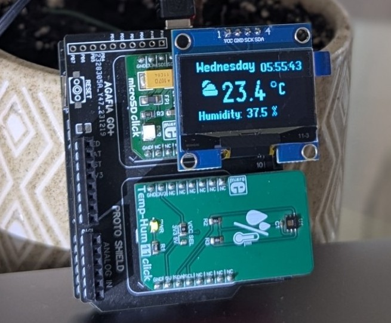

# Home Weather System using Agafia SG0+

## Overview
Home Weather System is a demonstration project showcasing the capabilities of the **Agafia SG0+ development board**. It is designed for **hobbyists and students** to explore embedded systems and prototyping.

The system captures **room temperature and humidity** using the Mickroe Click Boards **TempHum (HDC1080) Click board**, periodically logs the data onto a **MicroSD card**, and presents it on a **SH1106 OLED display** with a beautifully designed interface. A **real-time clock (RTC)** provides date and time stamps for logging. Users can interact with the system via **serial commands** to set the RTC, read logs, or clear logs.

---

## Hardware Components

| Component              | Description |
|------------------------|-------------|
| **Dev Board**          | Agafia SG0+ |
| **ProtoShield**        | Agafia SG0 Shield (supports two MikroBus slots) |
| **Click Boards**       | MicroSD Click & TempHum (HDC1080) Click |
| **Display**           | SH1106 OLED |
| **Flash/Debugger**     | STlink V3mini (using onboard STLink connector) |

---

## Features & Functionalities

- **Temperature & Humidity Monitoring**: Uses TempHum Click board to capture environmental data.
- **Data Logging**: Stores temperature and humidity readings periodically onto the MicroSD card.
- **OLED Display**: Presents real-time temperature and humidity in a user-friendly interface.
- **Real-Time Clock (RTC) Support**: Provides timestamps for logs and user reference.
- **Serial Commands Interface**: Allows users to interact with the system via UART.

---

## Serial Commands

Users can send commands via a **serial terminal** to control the system:

| Command           | Description |
|------------------|-------------|
| `s{epoch}`      | Set/update RTC timestamp (epoch format) |
| `r`             | Read saved logs from MicroSD card |
| `f`             | Clear all stored logs |

---

## Expanding the Project

- **Edge Impulse AI Integration**: Users can extend this example to include AI-based analytics and predictions.
- **STM32 RTOS in Arduino**: The sample code is written using STM32 RTOS in Arduino, allowing users to experiment with **mutex** and **semaphores** to understand **RTOS** concepts.

---

## Getting Started

1. **Set up the hardware** by connecting components to the Agafia SG0+ board.
2. **Flash the firmware** using STlink V3mini.
3. **Open a serial terminal** to interact with the system.
4. **Monitor readings on the OLED** or **retrieve logs** from the MicroSD card.

---

## License

This project is open-source and available for further development and customization.
Feel free to extend the functionalities and experiment with new features!  🚀
